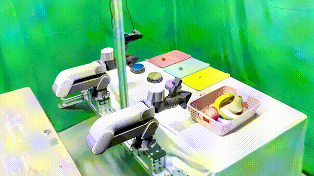

# ManipArena-Sim

ManipArena-Sim is the simulation environment for [**ManipArena**](https://maniparena.x2robot.com), a real-robot benchmark for bimanual manipulation. It provides data collection, replay, and policy evaluation for the bimanual robot, built on [Isaac Lab](https://github.com/isaac-sim/IsaacLab) and [IsaacLab-Arena](https://github.com/isaac-sim/IsaacLab-Arena).

> **Related repo:** [ManipArena](https://github.com/maniparena/maniparena-repo) — model server template for submitting your policy.

## Demos

### Robot Overview



### Sort Blocks


### Buttons Contact


### Fruits to Basket


## Features

- **Bimanual** robot with SE(3) differential-IK and joint-position action spaces
- **3 tabletop tasks**: `sort_blocks`, `fruits_to_basket`, `buttons_contact`
- **3 teleoperation modes**: keyboard, Vuer (Pico WebXR), master-slave
- **Trajectory replay**: state / joint / end-effector modes from HDF5 or LeRobot datasets
- **Policy evaluation**: closed-loop inference via WebSocket server-client architecture
- **Data export**: `bimanual_lerobot` (Parquet + video) and `hdf5` formats

## Prerequisites

- **OS**: Ubuntu 22.04 / 24.04 with NVIDIA GPU
- **Python**: 3.12 (Arena / Lab 3 requirement)
- **CUDA**: 12.8 (recommended)
- **NVIDIA Driver**: 570+ (recommended)
- **[uv](https://docs.astral.sh/uv/)** (installed automatically by `install.sh` if missing)
- Stack pulled by the installer:
  - [IsaacLab-Arena](https://github.com/isaac-sim/IsaacLab-Arena) `main`
  - Arena-pinned [Isaac Lab](https://github.com/isaac-sim/IsaacLab)
  - Isaac Sim 6.x binary wheels

## Installation

One-click host install (recommended):

```bash
git lfs install
git clone --recurse-submodules https://github.com/maniparena/maniparena-sim.git
cd maniparena-sim
source ./install.sh
```

Activate later sessions with:

```bash
source 3rd/isaaclabarena/.venv/bin/activate
export OMNI_KIT_ACCEPT_EULA=YES ACCEPT_EULA=Y
```

See [docs/install.md](docs/install.md) for installer details and optional modes.

## Project Structure

```text
maniparena-sim/
├── install.sh              # Lab 3 + Sim 6 + Arena environment installer
├── 3rd/isaaclabarena/      # IsaacLab-Arena submodule
├── assets/                 # USD scene and object assets (Git LFS)
├── configs/                # Collection, evaluation, replay and task configs
├── scripts/                # Collection, evaluation and replay entry points
└── src/maniparena_sim/     # Simulation package
    ├── embodiment/         # Bimanual robot, actions and sensors
    ├── environment/        # Environment and scene assembly
    ├── task/               # Task definitions and builders
    ├── terms/              # Recorders, replay, termination and metrics
    ├── planners/           # Teleoperation planners
    ├── loops/              # Collection and replay loops
    └── policy/             # Policy inference client
```

## Usage

### Data Collection

Collect teleoperation demonstrations with keyboard, Vuer, or master-slave control:

```bash
# Keyboard (Kit viewport required)
python scripts/collect.py \
    --robot bimanual \
    --task sort_blocks \
    --control-mode keyboard \
    --config configs/collect/keyboard.yaml \
    --viz kit

# Vuer (Pico WebXR) — adb reverse, then https://vuer.ai?ws=ws://localhost:8012
python scripts/collect.py \
    --robot ex001 \
    --task fruits_to_basket \
    --control-mode vuer \
    --config configs/collect/vuer.yaml \
    --viz kit

# Same Vuer path for the desktop bimanual arm
python scripts/collect.py \
    --robot bimanual \
    --task sort_blocks \
    --control-mode vuer \
    --config configs/collect/vuer.yaml \
    --viz kit

# Master-slave arm
python scripts/collect.py \
    --robot bimanual \
    --task sort_blocks \
    --control-mode master_slave \
    --config configs/collect/master_slave.yaml \
    --viz kit
```

Isaac Lab / Sim 6 defaults to headless. Pass `--viz kit` when using keyboard input.

#### Keyboard Controls

The keyboard controller drives the **active arm** (left by default) in SE(3) space.

**Translation:**

| Key | Axis | Direction |
|-----|------|-----------|
| `W` | X    | +X (forward) |
| `S` | X    | −X (backward) |
| `A` | Y    | +Y (left) |
| `D` | Y    | −Y (right) |
| `Q` | Z    | +Z (up) |
| `E` | Z    | −Z (down) |

**Rotation:**

| Key | Axis | Direction |
|-----|------|-----------|
| `Z` | Roll  | +Roll (around X) |
| `X` | Roll  | −Roll (around X) |
| `T` | Pitch | +Pitch (around Y) |
| `G` | Pitch | −Pitch (around Y) |
| `C` | Yaw   | +Yaw (around Z) |
| `V` | Yaw   | −Yaw (around Z) |

**Function keys:**

| Key | Action |
|-----|--------|
| `B` | Switch active arm (left ↔ right) |
| `K` | Toggle gripper (open / close) |
| `H` | Save current episode as success |
| `R` | Reset / skip current episode |

#### VR Control

VR teleoperation supports Apple Vision Pro (dual-hand tracking) and PICO / Quest (vr-controller, vr-hand). For configuration and setup, refer to the Isaac Sim documentation:

<https://isaac-sim.github.io/IsaacLab/main/source/how-to/cloudxr_teleoperation.html#cloudxr-teleoperation>

Controller quick guide (PICO / Quest):
- **Trigger**: open / close gripper
- **Joystick**: move the base
- **Grip button**: toggle base movement mode (rotate in place or translate)
- By default, the right controller operates the robot. For dual-arm control, use the left controller's trigger or joystick for the second arm.

### Trajectory Replay

Replay collected demonstrations for verification or LeRobot format export.
Isaac Lab / Sim 6 defaults to headless; pass `--viz kit` to open the Kit viewport.

```bash
# HDF5 replay (state / joint / ee)
python scripts/replay.py \
    --task sort_blocks \
    --config configs/replay/hdf5.yaml \
    --viz kit

# LeRobot replay (joint / ee)
python scripts/replay.py \
    --task sort_blocks \
    --config configs/replay/lerobot.yaml \
    --viz kit
```

Set `export_lerobot: true` in `configs/replay/hdf5.yaml` to export LeRobot format during HDF5 replay.

### Policy Evaluation

Evaluate a remote policy via WebSocket server-client architecture:

```bash
python scripts/eval.py \
    --robot bimanual \
    --task sort_blocks \
    --config configs/eval/robot.yaml \
    --viz kit
```

Configure the policy server address in `configs/eval/robot.yaml`:

```yaml
policy_config:
  model_address: "localhost"
  model_port: 8000
  instruction: "sort the blocks"
```

The policy server must be running and accessible before launching evaluation.

## Configuration

All runtime parameters are driven by YAML files under `configs/`:

| Config | Description |
|--------|-------------|
| `configs/collect/keyboard.yaml` | Keyboard collection settings |
| `configs/collect/vr.yaml` | VR collection settings |
| `configs/collect/master_slave.yaml` | Master-slave collection settings |
| `configs/replay/hdf5.yaml` | HDF5 replay (with optional LeRobot export) |
| `configs/replay/lerobot.yaml` | LeRobot replay |
| `configs/eval/robot.yaml` | Robot policy evaluation |
| `configs/tasks/*.yaml` | Task-specific parameters |

## Supported Tasks

| Task | Description |
|------|-------------|
| `sort_blocks` | Sort colored blocks onto matching colored papers |
| `fruits_to_basket` | Pick fruits and place them into a basket |
| `buttons_contact` | Press all three colored buttons in sequence |

## License

Apache License 2.0
