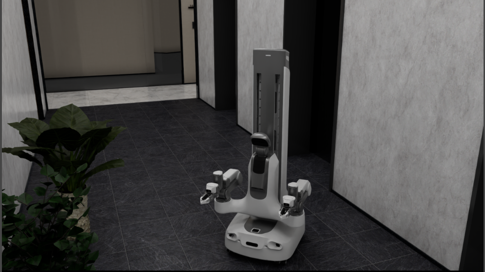
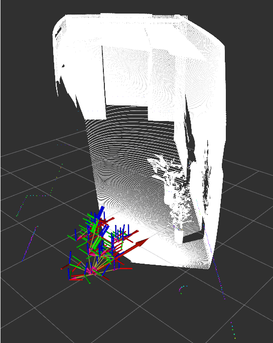

# EX001-sim

Isaac Sim simulation for the **EX001** whole-body mobile manipulator: mobile base, dual 6-DOF arms, lift platform, and four onboard cameras. Built on [Isaac Lab](https://github.com/isaac-sim/IsaacLab) and [IsaacLab-Arena](https://github.com/isaac-sim/IsaacLab-Arena).

Two workflows:

- **Teleop collection** — keyboard or Vuer (Pico WebXR) teleoperation with HDF5 + MP4 recording
- **ROS2 navigation** — publish sensor topics and accept external chassis / joint commands

Detailed guide (Chinese): [docs/ex001.md](docs/ex001.md)

## Demos

### Teleop (`fruits_to_basket`, Vuer)


### ROS2 navigation (`nav_f16`)

Isaac Sim:



RViz (point cloud, `/scan`, TF):



## Features

- **EX001 embodiment** — differential-drive base, prismatic lift, dual arms + grippers, head IMU, four cameras
- **3 manipulation tasks** on the green-booth tabletop: `sort_blocks`, `fruits_to_basket`, `buttons_contact`
- **Teleop modes** — keyboard (arm / base switching) and Vuer WebXR (Pico browser)
- **ROS2 bridge** — joint state, odometry, IMU, laser scan, depth point cloud, compressed images; subscribes to joint commands and `cmd_vel`
- **Data export** — HDF5 episodes with sidecar MP4 (wrist ×2, head, chassis cameras) at 20 Hz

## Prerequisites

- **OS**: Ubuntu 22.04 / 24.04 with NVIDIA GPU
- **Python**: 3.12 (Arena / Lab 3 requirement)
- **CUDA**: 12.8 (recommended)
- **NVIDIA Driver**: 570+ (recommended)
- **[uv](https://docs.astral.sh/uv/)** (installed automatically by `install.sh` if missing)
- Stack pulled by the installer (GitHub):
  - [IsaacLab-Arena](https://github.com/isaac-sim/IsaacLab-Arena) `main` (Lab 3 + Sim 6)
  - [Isaac Lab](https://github.com/isaac-sim/IsaacLab) Arena-pinned SHA (Lab 3.0; nested under Arena)
  - **Isaac Sim 6.x binary wheels** via Arena `uv sync` (no Sim source build)
- **ROS2 navigation only**: a supported ROS2 distro (e.g. Humble) with `isaacsim.ros2.bridge` — see [Isaac Sim ROS install guide](https://docs.isaacsim.omniverse.nvidia.com/latest/installation/install_ros.html)

## Installation

One-click host install (recommended). Requires Git LFS for USD assets under `assets/`.

```bash
git lfs install
git clone --recurse-submodules https://github.com/maniparena/maniparena-sim.git
cd maniparena-sim
source ./install.sh
```

This will:

1. Ensure submodule `3rd/isaaclabarena` (Arena `main`)
2. Init nested Lab only (skips GR00T) and pin it to Arena's recorded Lab SHA (Lab 3.0)
3. Install a **lean sim stack** into `3rd/isaaclabarena/.venv`:
   - `isaaclab[isaacsim]` → Isaac Lab + **Isaac Sim 6 wheels**
   - Lab companions required by ArenaEnvBuilder: `assets` / `physx` / `newton` / `ov` / `ovphysx` / `tasks` / `teleop`
   - `isaaclab_arena` editable with thin deps (`vuer`, `pydantic`, …) — **not** Arena's full `uv sync`
   - `maniparena_sim` editable

**Excluded by default** (not needed for teleop / ROS2 nav): `openpi`, GR00T, `isaaclab_mimic`, `isaaclab_rl`, newton/rerun/viser visualizers、tasks-experimental、contrib、experimental、ppisp, Arena analysis extras (`openai` / `sbi` / `onnxruntime` / …). Kit viewport support (`isaaclab_visualizers[kit]`) is included for `--viz kit`.

Activate later sessions with:

```bash
source 3rd/isaaclabarena/.venv/bin/activate
export OMNI_KIT_ACCEPT_EULA=YES ACCEPT_EULA=Y
```

Optional:

- `source ./install.sh --skip-stack` — only refresh git sources
- `source ./install.sh --full-arena-stack` — Arena upstream fat `uv sync` (heavy; not recommended)
- More detail: [docs/install.md](docs/install.md)

If you cloned without `--recurse-submodules`, `install.sh` initializes them.

## Project Structure

```text
EX001-sim/
├── install.sh           # one-click Lab3 + Sim6(wheels) + Arena + this package
├── 3rd/isaaclabarena/   # git submodule → IsaacLab-Arena (main)
│   └── submodules/IsaacLab/  # nested; installer pins to Arena submodule SHA
├── assets/              # USD robot & scene assets (Git LFS)
├── configs/
│   ├── collect/         # keyboard.yaml, vuer.yaml
│   ├── navigate/        # ex001_nav.yaml
│   └── tasks/           # per-task parameters
├── docs/
│   ├── ex001.md         # full usage guide
│   └── install.md       # install design / details
├── scripts/
│   ├── collect.py       # teleop data collection
│   └── navigate_ros2.py # ROS2 navigation bridge
└── src/maniparena_sim/
    ├── embodiment/robots/ex001.py
    ├── ros/             # ROS2 pub/sub bridge
    ├── planners/        # EX001 teleop planners
    └── terms/recorders/ # streaming HDF5 + MP4 export
```

## Usage

### Teleop collection

Isaac Lab / Sim **6.0** defaults to headless. Pass `--viz kit` to open the Kit viewport (required for keyboard teleop).

```bash
# Keyboard (needs Kit UI)
python scripts/collect.py \
  --robot ex001 \
  --task fruits_to_basket \
  --control-mode keyboard \
  --config configs/collect/keyboard.yaml \
  --viz kit

# Vuer (Pico WebXR) — open https://<host-ip>:8012 in the Pico browser
python scripts/collect.py \
  --robot ex001 \
  --task fruits_to_basket \
  --control-mode vuer \
  --config configs/collect/vuer.yaml \
  --viz kit
```

Swap `fruits_to_basket` for `sort_blocks` or `buttons_contact`. Recordings go to `~/maniparena_output/recordings/ex001_<task>_collect/`.

Click the Isaac Sim viewport before using keyboard input. Omit `--viz` (or use `--viz none`) for headless runs.

### ROS2 navigation

Source your ROS2 environment, then:

```bash
python scripts/navigate_ros2.py \
  --config configs/navigate/ex001_nav.yaml \
  --enable_cameras \
  --viz kit
```

Keyboard: `W`/`S` drive, `A`/`D` or `Q`/`E` turn, `R` reset. External `/chassis/cmd_vel` is summed with keyboard velocity.

See [docs/ex001.md](docs/ex001.md) for control mappings, topic list, and ROS setup.

## Configuration

| Config | Description |
|--------|-------------|
| `configs/collect/keyboard.yaml` | Keyboard teleop scales and recorder settings |
| `configs/collect/vuer.yaml` | Vuer port and teleop settings |
| `configs/navigate/ex001_nav.yaml` | ROS2 navigation scene and bridge settings |
| `configs/tasks/*.yaml` | Task-specific parameters |

## Supported Tasks

| Task | Description |
|------|-------------|
| `sort_blocks` | Sort colored blocks onto matching colored papers |
| `fruits_to_basket` | Pick fruits and place them into a basket |
| `buttons_contact` | Press all three colored buttons in sequence |

## License

Apache License 2.0
